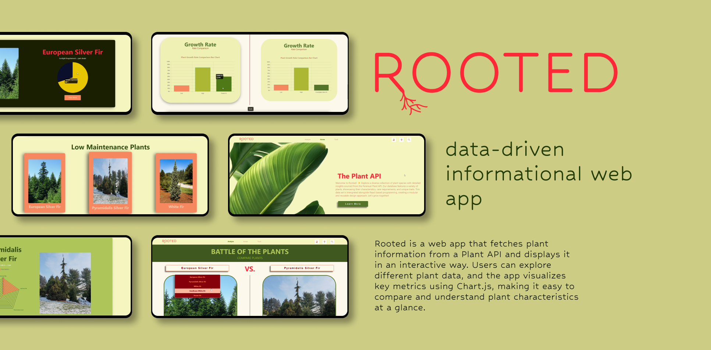
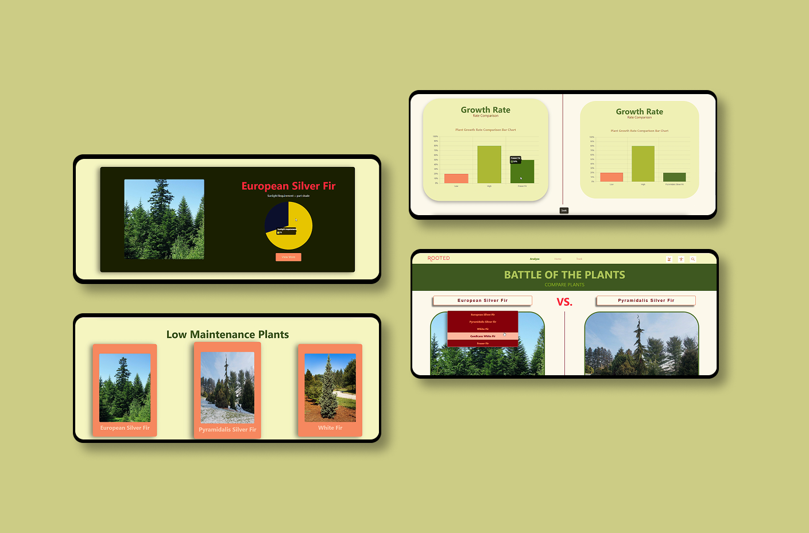
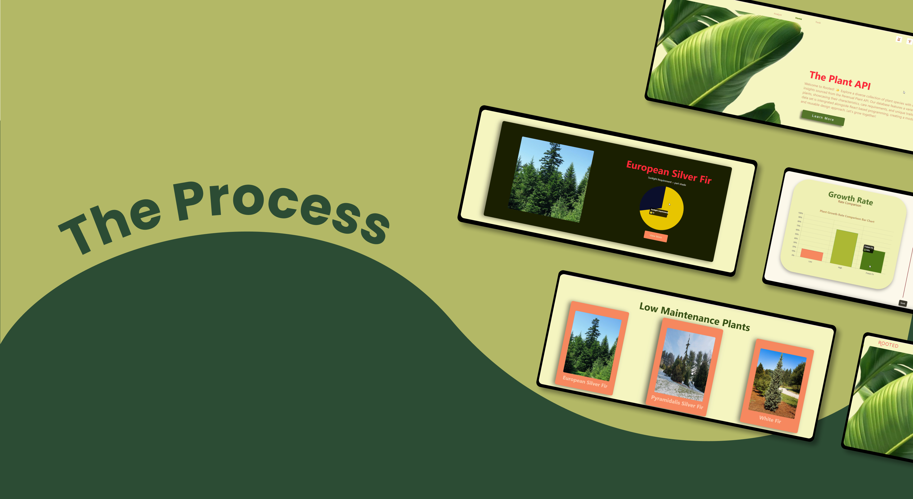

<!-- ================= HEADER IMAGE ================= -->


##  Rooted – Plant Info & Chart Visualization App

**What is Rooted?**

Rooted is a data-driven web application that allows users to explore plant information fetched from a Plant API. The app visualizes plant characteristics using interactive charts with Chart.js, making it easy to compare and understand different plant metrics. It was built to demonstrate API integration, data visualization, and dynamic front-end functionality, providing a clear, engaging way to interact with plant data. The outcome is a visually informative app that presents real data in an accessible and interactive format.


### 🛠️ Built With


---

### 🌿 About the Plant API

Rooted integrates with the **Perenual Plant API**, a comprehensive plant database that provides detailed information about thousands of plant species worldwide. The API offers rich data including plant characteristics, care requirements, growth patterns, sunlight needs, watering schedules, and high-quality images. This reliable data source enables our application to deliver accurate, real-time plant information for educational and comparison purposes, making it an ideal foundation for data visualization and interactive plant exploration.

**API Documentation**: [https://perenual.com/docs/api](https://perenual.com/docs/api)

---

###  Getting Started

Follow these instructions to **run Rooted locally**.

####  Prerequisites
| Software | Version | Link |
|----------|--------|------|
| Node.js | v16+ | [Download Node.js](https://nodejs.org/) |
| npm | Latest | Comes with Node.js |
| React | Latest | Included via create-react-app |
| Chart.js | Latest | Included as dependency |
| Plant API | Public | No key required |

>  Recomended: Use **VS Code** for best editing experience.

---

#### How to Install & Run Locally

1. **Clone the repository**  

```bash
git clone https://github.com/danaeswart/rooted.git
```


2. **Navigate to the project** 
```bash
cd "Rooted root/my-react-app"
```

3. **Install dependencies** 

```bash
npm install
```
4. **Start the development servert** 


```bash
npm start
```
4. **Open the app in your browser** 

```bash
Go to http://localhost:3000
```



###  Key Features
- Fetches plant information dynamically from a **Plant API**  
- Displays interactive charts using **Chart.js**  
- Allows users to **compare plant data visually**  
- Lightweight, front-end focused, and educational  

---



This section documents the creative and technical decisions behind **Rooted**. It includes the architecture, design decisions, challenges, and testing approaches.

---

### Architecture / System Design
Rooted is a **React-based web application** with a modular component structure. The architecture allows dynamic data fetching and interactive chart visualization.


###  Theme / UI & UX Approach
The app focuses on **clarity and interactivity**:
- Charts to visualize plant metrics for easy comparison
- Modular React components for reusable code
- Friendly color palette and readable typography

<!-- Insert moodboard / color palette image here -->


---

### 🛠 Technical Decisions
- **React** – for modular, reusable components and state management  
- **Chart.js** – for responsive, interactive charts  
- **API Integration** – dynamic plant data ensures the app is informative and flexible

--- 

### Conclusion

**Project Highlights:**  
- Successfully integrated a **Plant API** to fetch dynamic plant data  
- Created **interactive charts** with Chart.js for visual comparison  
- Built a modular, **React-based front-end** with reusable components  

**Challenges & Solutions:**  
| Challenge | Solution |
|-----------|---------|
| Formatting and displaying API data in charts | Used mapping functions and React state updates |
| Making charts responsive across devices | Configured Chart.js options and applied CSS styling |
| Maintaining modular code structure | Broke the UI into reusable components and managed state efficiently |

**Future Improvements / Features:**  
- Add a **search and filter** function for plants  
- Include **more plant metrics** from additional APIs  
- Implement **user accounts** to save favorite plants  
- Enhance **UI/UX** with animations and interactive tooltips  

---

##  Solution and Final Thoughts
Rooted demonstrates how modern web technologies can turn complex plant data into an engaging, educational platform. By integrating the Perenual Plant API with Chart.js, users can easily compare plant characteristics, understand care requirements, and explore botanical diversity in a user-friendly, interactive format. The responsive, component-based React design ensures a smooth experience across devices while keeping the code maintainable and scalable.

---

## Acknowledgements  

**Created By:**  
- Danae Swart – [GitHub](https://github.com/danaeswart)

**Contributions / Resources:**  
- React Documentation: [https://reactjs.org/](https://reactjs.org/)  
- Chart.js Documentation: [https://www.chartjs.org/](https://www.chartjs.org/)  
- Plant API: [https://plantapi.com](https://plantapi.com)  


**Acknowledgements:**  
Thanks to peers and mentors for feedback during development and testing. Thank you to my lecture for all the knowledge and advice.

<!-- Optional: add a badge or fun image to close the README -->


